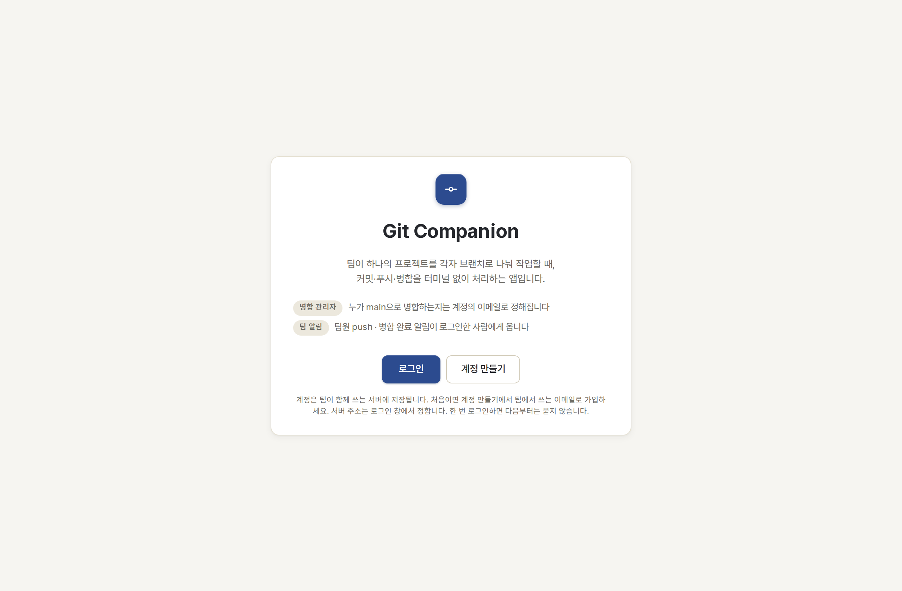
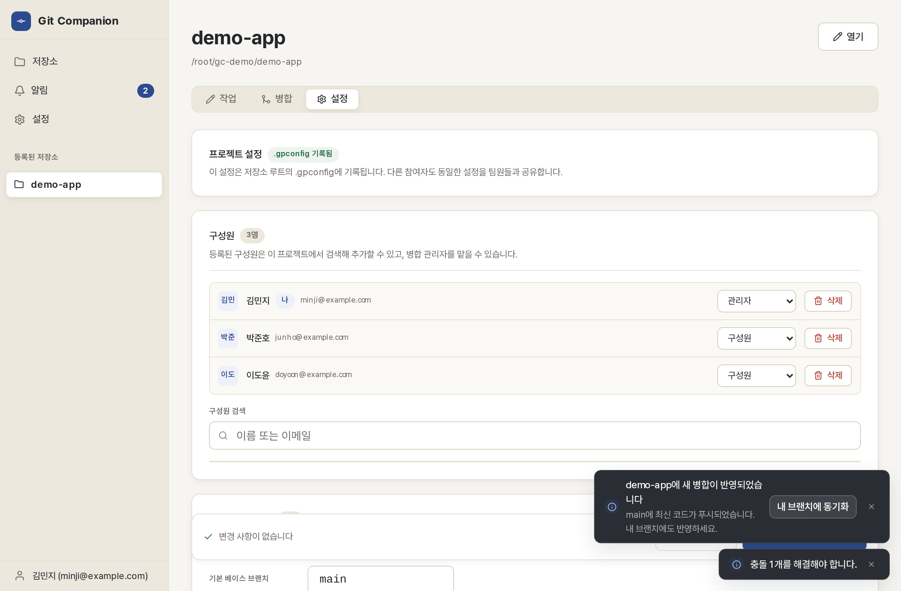
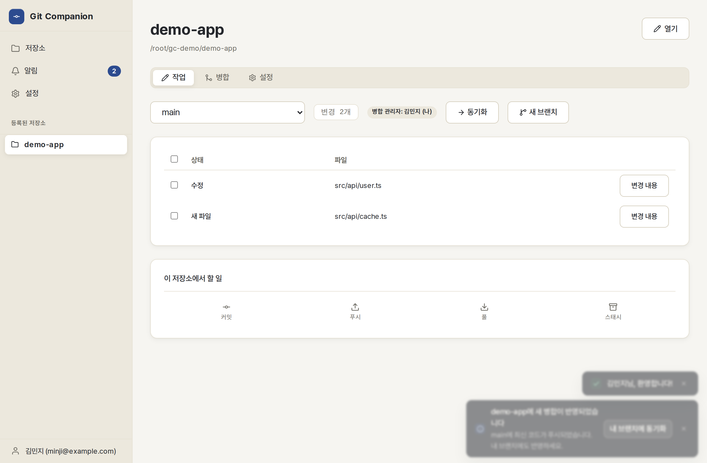
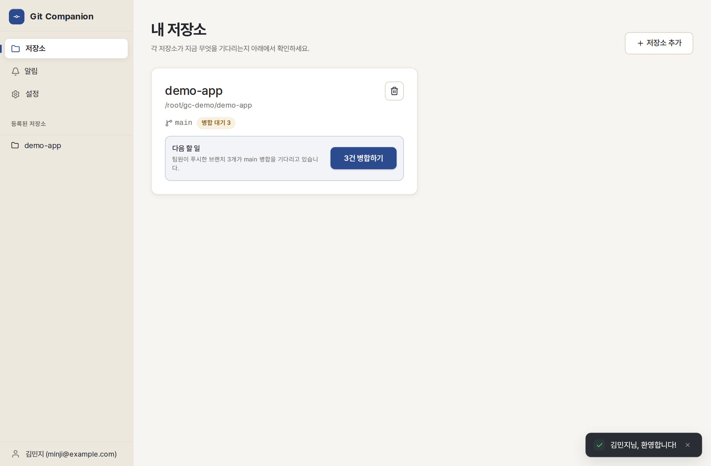
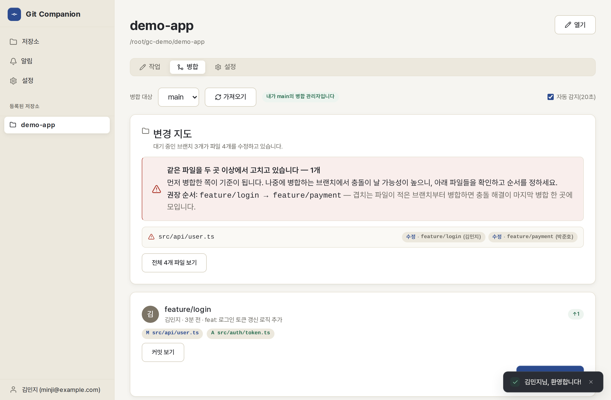
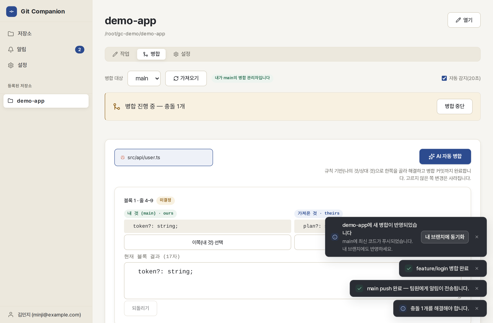

# Git Companion

한 프로젝트를 여러 사람이 git으로 함께 관리할 때, **각자 브랜치 → push →
병합 관리자가 병합 브랜치로 모으기 → 팀원 동기화**의 한 바퀴를 터미널 없이
돌릴 수 있게 만든 데스크톱 앱입니다.

```bash
git clone https://github.com/senghan1992/team-git.git
```

- **설치하기** → 아래 [설치 · 빌드](#설치--빌드) — 설치 파일 배포 없이 소스를 받아 직접 빌드합니다. 도구 설치부터 실행까지 **명령어를 순서대로 복사해 붙여넣기만** 하면 됩니다 (Windows / Linux / macOS).
- **사용법(스크린샷)** → 아래 [팀 6명이 시작하는 법](#팀-6명이-시작하는-법--화면으로-보는-사용법) — 실제 화면과 함께 역할별로.
- 전체 흐름과 화면별 사용법(상세) → **[docs/WORKFLOW.md](docs/WORKFLOW.md)**
- 빌드 없이 **브라우저에서 바로 보면서 작업** → **[docs/PREVIEW.md](docs/PREVIEW.md)** — `pnpm seed:demo && pnpm dev:web` 두 줄이면 됩니다.

## 이 앱이 푸는 문제

| 문제 | 이 앱의 답 |
| --- | --- |
| 팀원이 push했는지 병합 관리자가 모른다 | push하면 **그 브랜치의 병합 관리자에게만** 알림이 간다. 홈 카드에 "N건 병합하기"로 남는다. |
| AI 에이전트를 쓰기 시작하니 어디가 어떻게 고쳐지는지 안 보인다 | 병합 탭의 **변경 지도** — 파일 기준으로 뒤집어, 여러 브랜치가 손댄 파일을 맨 위에 세우고, 충돌이 덜 나는 **병합 권장 순서**까지 제안한다. |
| 병합하다 충돌이 나면 거기서 멈춘다 | **AI 자동 병합** — 지침(프롬프트)을 미리 저장해 두면 충돌이 난 순간 알아서 고치고 병합 커밋까지 만든다. 원본은 항상 백업되고, 충돌 표시가 남은 파일은 절대 커밋되지 않으며, AI가 못 고친 파일을 통째로 한쪽만 남기지도 않는다(팀원의 커밋이 조용히 사라지지 않게). AI가 고친 병합은 관리자가 결과를 확인한 뒤에야 push된다. |
| 병합된 최신 코드를 내 브랜치에 가져오는 게 번거롭다 | 병합이 push되면 팀원 전원에게 알림 + **동기화** 버튼 한 번. |
| 병합이 끝난 브랜치가 origin에 쌓인다 | 병합 탭의 **브랜치 정리** — 커밋이 전부 병합 브랜치에 들어간 브랜치만 골라 origin에서 지운다. 병합 안 된 커밋이 있으면 거부한다. |
| 버튼이 많아서 뭘 눌러야 할지 모른다 | 홈의 저장소 카드가 상태를 읽어 **다음 할 일 하나**를 제안한다 (충돌 해결 → 병합 → 커밋 → 푸시 → 동기화 순). |

## 팀 6명이 시작하는 법 — 화면으로 보는 사용법

역할은 두 가지뿐입니다: **병합 관리자 1명**(팀원들의 브랜치를 main으로 모으는
사람)과 **일반 팀원**. 아래 순서 그대로 따라 하면 됩니다. 더 깊은 내용은
[docs/WORKFLOW.md](docs/WORKFLOW.md)에 다 있습니다.

### 0. 처음 열면 — 로그인



앱을 켜면 로그인 화면이 나옵니다. **로그인해야 들어갈 수 있습니다** — 누가
병합 관리자인지, 이 push 알림이 누구 것인지가 전부 계정의 이메일로 정해지기
때문입니다. 한 번 로그인하면 재시작·오프라인에도 유지되고 다시 묻지 않습니다.

아래 **0-1. 팀 서버 띄우기**를 한 사람이 끝낸 뒤, 각자 로그인 창의 **서버
주소**에 그 컴퓨터 주소(`http://서버IP:8000`)를 넣고(**연결 확인**이 바로 됩니다)
**계정 만들기**로 가입하세요. **이메일이 곧 팀 안의 신분**입니다 — 병합 관리자
지정이 이메일로 매칭되므로 팀에서 쓰는 이메일로 가입하세요.

### 0-1. 팀 서버 띄우기 — 팀에서 한 사람만, 한 번만

알림(팀원 push → 관리자에게, 병합 push → 전원에게 "동기화하세요")과 계정은
작은 팀 서버(FastAPI)가 중계합니다. **팀원 모두가 접속할 수 있는 컴퓨터** 한
대(사무실 서버, 늘 켜 두는 PC, 작은 VM)에서 띄웁니다. 두 방법 중 하나만 고르세요.

**방법 A — Docker (권장, 세 줄)**. [Docker Desktop](https://www.docker.com/products/docker-desktop/)
이나 docker 엔진만 있으면 됩니다.

```bash
git clone https://github.com/senghan1992/team-git.git
cd team-git
docker compose up -d
```

처음 한 번은 이미지를 빌드하느라 1~2분 걸립니다. 계정·팀·알림은
`team-git/data/gc_peer.db` 파일 하나에 남고, 컴퓨터를 재시작해도 서버가 자동으로
다시 뜹니다. 로그는 `docker compose logs -f`, 내리기는 `docker compose down`(데이터는
남음), 다른 포트는 `GC_PORT=9000 docker compose up -d`.

**방법 B — Docker 없이 (Python 3.11 이상)**. Rust나 Node는 필요 없습니다.

Linux / macOS:

```bash
git clone https://github.com/senghan1992/team-git.git
cd team-git/backend
python3 -m venv .venv && ./.venv/bin/pip install -e ".[dev]"
./.venv/bin/uvicorn app.main:app --host 0.0.0.0 --port 8000
```

Windows (PowerShell):

```powershell
git clone https://github.com/senghan1992/team-git.git
cd team-git\backend
py -3 -m venv .venv; .\.venv\Scripts\pip install -e ".[dev]"
.\.venv\Scripts\uvicorn app.main:app --host 0.0.0.0 --port 8000
```

그다음 확인할 것:

1. 같은 컴퓨터에서 브라우저로 `http://127.0.0.1:8000/healthz` 를 열어
   `{"status":"ok"}` 가 보이면 서버는 정상입니다.
2. 방화벽에서 **8000 포트를 열고**, 팀원들에게 `http://서버IP:8000` 을 알려
   줍니다. 각자 앱의 로그인 화면 **서버 주소**에 넣고 **연결 확인** → "서버에
   연결됩니다"가 나오면 가입·로그인합니다.
3. (방법 B만) 터미널을 닫아도 살아 있게 하려면 Linux는
   `nohup ./.venv/bin/uvicorn app.main:app --host 0.0.0.0 --port 8000 > server.log 2>&1 &`,
   Windows는 창을 최소화해 두거나 **작업 스케줄러**에 "로그온 시 실행"으로
   등록합니다. Docker는 이미 자동 재시작으로 떠 있습니다.
4. **팀 만들기(관리자) → 참여 코드로 합류(팀원)** — 앱의 사이드바 **알림 →
   알림 설정**에서 관리자가 **팀 만들기**를 누르고 나온 **참여 코드**를 팀원에게
   알려 줍니다. 팀원은 같은 화면에서 **참여 코드로 합류**합니다. 그리고 각자
   **알림 받을 저장소**에서 등록한 저장소를 체크합니다. 이 연결이 있어야 그
   저장소의 push 알림이 팀에 흐릅니다 (한 번만 하면 됩니다).

알아 둘 점:

- 계정·팀·알림은 **SQLite 한 파일**에 저장됩니다 — Docker는 `team-git/data/gc_peer.db`,
  Python 직접 실행은 `backend/gc_peer.db`. 백업은 이 파일을 복사하면 되고, 지우면
  계정부터 다시 만들어야 합니다.
- 서버가 꺼져 있어도 팀원들의 **커밋·푸시·병합·충돌 해결은 전부 정상**입니다.
  알림만 각자 컴퓨터에 보관되다가 서버가 살아나면 자동으로 재전송됩니다.
- 사무실 밖(인터넷)에서 접속하게 한다면 nginx/Caddy 같은 **HTTPS 리버스
  프록시** 뒤에 두세요 — 로그인 토큰이 그대로 오가기 때문입니다.

### 1. 관리자가 한 번만 — 저장소 등록 + 팀 규칙

**+ 저장소 추가**로 프로젝트 폴더를 등록하고, 저장소의 **설정** 탭에서
구성원과 **브랜치별 병합 관리자**를 지정합니다. 이 규칙은 `.gpconfig`
파일로 **저장소 안에 커밋**되므로, 팀원 모두가 같은 규칙을 봅니다.



팀원들은 각자 `git clone` 받은 폴더를 똑같이 **+ 저장소 추가**로 등록하면
끝입니다 (폴더 이름이 서로 달라도 됩니다 — 앱이 원격 주소로 알아봅니다).

### 2. 팀원의 하루 — 브랜치 → 커밋 → 푸시

작업 탭에서 **새 브랜치**(예: `feature/로그인`)를 만들고 평소처럼 코딩합니다.
바뀐 파일이 상태 표에 나타나고, 파일 이름을 누르면 변경 내용(diff)을
미리 볼 수 있습니다. **커밋 → 푸시** 두 번이면 관리자에게 알림이 갑니다.



> ⚠ **main에서 직접 작업하지 마세요.** 항상 내 브랜치를 만들어 작업하고,
> main은 병합 관리자만 만집니다. 홈 카드의 **다음 할 일**이 지금 해야 할
> 것을 알려 주니, 뭘 눌러야 할지 모르겠으면 홈으로 가면 됩니다.

### 3. 관리자의 하루 — 알림 받고 병합

팀원이 푸시하면 관리자가 **어느 화면에 있든** 오른쪽 아래에 "○○ 브랜치가
병합을 기다립니다" 알림이 뜨고(**병합하기** 버튼으로 바로 이동), 사이드바
**알림** 배지에 읽지 않은 수가 남습니다. 홈 카드에는 **"N건 병합하기"**로
쌓입니다. 알림 탭에서는 카드별 **읽음 표시**와 **모두 읽음**으로 정리합니다.



병합 탭 맨 위의 **최근 7일 병합 흐름**은 어떤 브랜치가 언제 작업돼 언제 main에
합쳐졌는지 시간축으로 보여 줍니다(아직 병합되지 않은 브랜치는 점선, 레인을
누르면 커밋·파일 목록). 그 아래 **변경 지도**가 "누가 어느 파일을 고치고
있는지"를 파일 기준으로 보여 주고, 같은 파일을 여러 명이 고치면 **충돌이 덜
나는 병합 순서까지 제안**합니다. 파일 칩을 누르면 실제 변경(diff)을 보고 나서
병합할 수 있습니다.



**main(으)로 병합**을 누르면 병합→push→팀원 전원에게 "동기화하세요" 알림까지
한 번에 진행됩니다.

### 4. 충돌이 나면 — 블록 단위로 고른다

충돌은 파일 전체가 아니라 **겹친 블록 단위**로 "내 것 / 가져온 것 / 직접
편집" 중에서 고릅니다. 아직 안 고른 블록에는 **미결정** 표시가 붙어 실수로
넘어갈 수 없습니다. 설정에서 AI를 켜 두면 **AI 자동 병합**이 저장해 둔
지침대로 알아서 고치고, 결과를 관리자가 확인한 뒤에만 push합니다.



오른쪽 아래 알림처럼, 병합이 push되는 순간 팀원들에게는 **"내 브랜치에
동기화"** 버튼이 뜹니다 — 팀원은 그 버튼 한 번으로 최신 main을 자기
브랜치에 반영하고 작업을 계속합니다. 이게 한 바퀴입니다.

### 안전장치 — 작업은 사라지지 않습니다

- 커밋하지 않은 변경이 있으면 동기화·병합·브랜치 전환이 **먼저 거부**되고
  무엇을 하면 되는지 알려 줍니다 (조용히 덮어쓰는 일 없음).
- AI 자동 병합은 손대기 전에 **원본을 백업**하고, 충돌 표시가 남은 파일은
  절대 커밋하지 않으며, 확신이 없으면 사람에게 남깁니다.
- 검토한 뒤 팀원이 push를 더 했다면 병합이 멈추고 새로고침을 요구합니다.
- 브랜치 정리는 커밋이 전부 main에 들어간 브랜치만 지울 수 있습니다.
- 팀 서버가 꺼져 있어도 커밋·푸시·병합은 전부 정상 동작합니다 — 알림만
  보관됐다가 서버가 살아나면 자동 재전송됩니다.

## 화면 구성

- **홈 (저장소)** — 등록된 저장소마다 브랜치·상태·**다음 할 일** 한 장.
- **저장소 → 작업** — 브랜치 전환, 새 브랜치 만들기, 상태 표(diff 미리보기,
  파일별 스테이징), 커밋 / 푸시 / 풀 / 스태시, 동기화.
- **저장소 → 병합** — 상단 **최근 7일 병합 흐름**(어떤 브랜치가 언제 작업돼
  언제 main에 합쳐졌는지 시간축으로, 병합 대기는 점선; 7/14/30일), 변경 지도,
  병합 대기 브랜치 목록, 병합 실행, 블록 단위 충돌 해결(나의 것 / 상대 것 /
  직접 편집 / AI 제안), AI 자동 병합, 백업 복원, 병합 후 push 배너.
- **저장소 → 설정** — `.gpconfig`: 병합 대상 브랜치, 브랜치별 병합 관리자, 구성원.
- **알림** — 받은 알림 + 알림 배달망 설정(팀·수신자).
- **설정** — **AI 자동 병합**, SSH 프로필/연결 테스트, 푸시 자격증명.

## 로그인 · 계정

**앱을 켜면 먼저 로그인합니다.** 병합 관리자 판정, 구성원 목록, 알림 수신자가
모두 계정의 이메일로 매칭되기 때문에 로그인 없이는 들어갈 수 없습니다. 한 번
로그인하면 토큰이 이 컴퓨터에 남아 재시작·오프라인에도 유지됩니다. 로그아웃하면
다시 로그인 화면으로 돌아갑니다.

계정은 **팀 서버의 SQLite**(`users` 테이블)에 저장됩니다. 그래서 어느 컴퓨터에서든
같은 아이디로 로그인하고, 팀원 검색(`.gpconfig` 구성원 추가)도 이 컴퓨터에서
로그인한 적 있는 사람이 아니라 **팀 전체**에서 찾습니다.

- 비밀번호는 PBKDF2-HMAC-SHA256(솔트, 21만 회)으로 해싱해 저장합니다 —
  평문도, 단순 SHA-256도 저장하지 않습니다.
- 앱은 **로그인한 사람과 토큰만** 로컬에 캐시합니다. 그래서 재시작·오프라인에도
  로그인이 유지되고, 새 로그인·회원가입·프로필 변경은 서버가 필요합니다.
- 마이페이지(사이드바의 내 이름) — 프로필 수정, 비밀번호 변경, 로그아웃,
  다른 계정으로 로그인, 회원 탈퇴.
- 서버 주소는 로그인 화면의 **서버 주소**에서 정합니다. 서버를 띄우는 방법은
  위 **0-1. 팀 서버 띄우기**에 있습니다.

### Google 로그인 (선택)

서버 관리자가 아래 설정을 마치면 로그인 화면에 **Google로 로그인** 버튼이
생깁니다 (설정이 없으면 버튼을 눌렀을 때 서버가 안내합니다).

1. [Google Cloud Console](https://console.cloud.google.com/apis/credentials)에서
   OAuth 클라이언트 ID(앱 유형: **데스크톱 앱**)를 만들고,**승인된 리디렉션
   URI**에 이 서버의 콜백 주소를 등록하세요 (콘솔에 등록한 값과 환경변수는
   반드시 같아야 합니다):

   ```
   http://127.0.0.1:8000/auth/google/callback   # 서버가 8000 포트일 때
   ```

2. 서버 실행 시 환경변수로 넣습니다:

   ```bash
   export GOOGLE_CLIENT_ID="....apps.googleusercontent.com"
   export GOOGLE_CLIENT_SECRET="GOCSPX-..."
   export GOOGLE_REDIRECT_URI="http://127.0.0.1:8000/auth/google/callback"
   cd backend && uvicorn app.main:app
   ```

   Docker 배포는 `docker-compose.yml` 에 네 변수로 추가하면 됩니다.

3. Google 로그인은 **계정을 새로 만들거나, 같은 이메일의 기존 계정으로
   로그인**합니다. Google 계정에는 비밀번호가 없어서 아이디/비밀번호
   로그인과 비밀번호 변경은 할 수 없지만, 팀 구성원·병합 관리자 매칭은
   이메일로 되므로 팀 기능은 동일하게 쓸 수 있습니다.

### 트레이 (닫아도 꺼지지 않음)

창의 **X(닫기) 버튼은 앱을 종료하지 않고 트레이(우측 하단 아이콘)로
숨깁니다.** 백그라운드에서 알림을 계속 받으려는 용도입니다.

- 트레이 아이콘 **왼쪽 클릭** — 창 열기/숨기기.
- 트레이 아이콘 **오른쪽 클릭** — 창 열기/숨기기, **Git Companion 종료**.
- 앱을 다시 실행하면(예: 시작 메뉴) 숨어 있던 창이 다시 열립니다 —
  새 프로세스가 생기지 않습니다.
- 정말로 끝내려면 트레이 메뉴의 **종료**를 쓰세요. 처음 X로 숨길 때 한 번만
  안내 알림이 갑니다.

## 그 밖의 기능

- **기본 UI 언어는 한국어** — 모든 문구가 한국어로 표시됩니다.
- **SSH 저장소 지원** — 원격 서버의 저장소를 SSH(키 또는 비밀번호)로 등록하고,
  원격 디렉터리 브라우저로 경로를 찾아갈 수 있습니다.
- **병합 브랜치는 main이 아니어도 됩니다** — `.gpconfig`의 병합 대상 브랜치를
  `develop`, `release/1.0` 등으로 자유롭게 정할 수 있고, 알림 분류도 그 설정을
  따릅니다 (`main`이 하드코딩된 곳은 없습니다).
- **스태시 관리** — 병합 전에 작업 트리를 비워야 할 때 저장/복원/삭제.
  새로 만든(untracked) 파일도 함께 보관되고, 복원 중 충돌이 나면 스태시
  항목을 지우지 않은 채 알려 줍니다.

## 설치 · 빌드

이 앱은 설치 파일을 따로 배포하지 않습니다 — **소스를 받아 내 컴퓨터에서 직접
빌드**합니다. 아래 명령을 위에서부터 순서대로 복사해 붙여넣기만 하면 됩니다.
개발 도구가 하나도 없는 컴퓨터 기준으로 도구 설치 30분 + 첫 빌드 10~20분이
걸리고, 두 번째 빌드부터는 몇 분이면 끝납니다.

Tauri는 크로스 컴파일을 지원하지 않으므로 **쓸 OS에서 빌드합니다** —
Windows용 `.exe`는 Windows에서, Linux용은 Linux에서 만듭니다.

### Windows에서 빌드하기 (.exe)

#### 1단계 — 도구 설치 (컴퓨터당 한 번만)

**PowerShell**을 열고(시작 메뉴에서 "PowerShell" 검색) 아래 네 줄을 한 줄씩
붙여넣으세요. 중간에 설치 동의 창이 뜨면 진행하면 됩니다.

```powershell
winget install --id Git.Git -e
winget install --id Rustlang.Rustup -e
winget install --id OpenJS.NodeJS.LTS -e
winget install --id Microsoft.VisualStudio.2022.BuildTools -e --override "--wait --passive --add Microsoft.VisualStudio.Workload.VCTools --includeRecommended"
```

- 마지막 줄(C++ 빌드 도구)은 몇 GB를 내려받아 **가장 오래 걸립니다**. 끝날 때까지 기다리세요.
- `winget`이 없는 오래된 Windows라면 아래에서 직접 내려받아 설치하세요
  (빌드 도구는 설치 화면에서 **"C++를 사용한 데스크톱 개발"** 워크로드에 체크):
  - Git for Windows: <https://git-scm.com/download/win>
  - Rust: <https://rustup.rs>
  - Node.js LTS: <https://nodejs.org>
  - Visual Studio Build Tools 2022: <https://visualstudio.microsoft.com/ko/visual-cpp-build-tools/>

설치가 끝나면 **PowerShell 창을 닫고 새로 여세요** (방금 설치한 도구들이
인식되려면 새 창이어야 합니다). 그리고 확인:

```powershell
git --version
cargo --version
node --version
```

세 줄 모두 버전 번호가 나오면 준비 끝입니다.

#### 2단계 — pnpm과 Tauri CLI 설치 (컴퓨터당 한 번만)

```powershell
npm install -g pnpm
cargo install tauri-cli --version "^2.0"
```

두 번째 줄은 Tauri 빌드 도구를 컴파일하느라 5~10분 걸립니다. 한 번만 하면 됩니다.

#### 3단계 — 소스 받고 빌드

```powershell
git clone https://github.com/senghan1992/team-git.git
cd team-git
pnpm install
cargo tauri build
```

첫 빌드는 10~20분 걸립니다 (Rust가 의존성 전부를 컴파일합니다). 끝에
`Finished` 와 번들 경로가 출력되면 성공입니다.

#### 4단계 — 실행

설치해서 쓰려면 (시작 메뉴에 등록됨):

```powershell
& ".\target\release\bundle\nsis\Git Companion_0.1.0_x64-setup.exe"
```

설치 없이 바로 실행해 보려면:

```powershell
& ".\target\release\git-companion.exe"
```

#### 5단계 — 업데이트 (새 버전 다시 설치)

앱은 백그라운드 알림용으로 `gc-peer-listener.exe` 라는 보조 프로세스를
띄웁니다. 옛 버전은 앱을 꺼도 이 보조 프로세스가 남아 자기 exe 파일을
잠가서, 새 버전 설치가 아래 오류로 실패했습니다:

```
Error opening file for writing C:\Users\…\Git Companion\gc-peer-listener.exe
```

지금 버전부터는 ① 앱이 죽으면 보조 프로세스도 1초 안에 같이 내려가고
(잡 객체 + 부모 감시), ② 설치기가 남은 보조 프로세스를 먼저 종료한 뒤
파일을 덮어씁니다 — 별도 조치 없이 **기존 버전 위에 바로 설치**하면
됩니다.

혹시 위 오류가 아직 나온다면(이 수정 전 버전의 보조 프로세스가 남아
있을 때) PowerShell에서 아래 줄을 실행한 뒤 설치 파일을 다시 돌리세요:

```powershell
taskkill /F /IM gc-peer-listener.exe
```

설치기(NSIS)가 새 버전을 깔 때 이 명령을 자동으로 실행하므로, 이 줄은
지금처럼 "수정 전 버전"에서 한 번만 필요합니다.

- 처음 실행할 때 파란 **"Windows의 PC 보호"** 창이 뜨면 **추가 정보 → 실행**을
  누르세요 (서명되지 않은 앱이라 뜨는 정상 경고입니다).
- 팀 push 알림까지 쓰려면 훅이 앱을 찾을 수 있어야 합니다. 아래 한 줄이면 됩니다
  (실행 후 새 터미널부터 적용):

```powershell
setx GIT_COMPANION_BIN "$PWD\target\release\git-companion.exe"
```

#### 문제가 생기면

| 증상 | 해결 |
| --- | --- |
| `'cargo'(또는 git, node, pnpm)은(는) … 인식되지 않습니다` | PowerShell 창을 닫고 새로 여세요. 그래도 안 되면 해당 도구를 1·2단계대로 다시 설치. |
| `error: linker 'link.exe' not found` / `failed to find tool "lib.exe"` | C++ 빌드 도구가 없다는 뜻 — 1단계의 마지막 `winget` 명령(Build Tools)을 다시 실행하고 끝까지 기다리세요. |
| `cargo tauri build`에서 `no such command: tauri` | 2단계의 `cargo install tauri-cli --version "^2.0"`이 안 끝났거나 실패한 것 — 다시 실행. |
| 빌드가 20분 넘게 걸린다 | 첫 빌드는 원래 깁니다. 멈춘 게 아니라 컴파일 중이면 그대로 두세요. |
| `pnpm install`에서 `[EISDIR] ... symlink ...` 에러 (Windows) | 이전 설치가 중간에 끊겨 pnpm 스토어에 잔재(실제 폴더)가 남은 것. 스토어 경로는 `pnpm config get store-dir`로 확인하고, 그 스토어 폴더와 프로젝트의 `node_modules`를 지운 뒤(`Remove-Item -Recurse -Force <스토어폴더>`, `Remove-Item -Recurse -Force .\node_modules`) `pnpm install` 재실행. 스토어는 캐시라 지워도 다시 받습니다. 스토어를 프로젝트와 같은 드라이브에 두는 것도 도움이 됩니다. |
| 앱은 뜨는데 저장소 등록·커밋이 전부 실패 | Git for Windows가 없는 컴퓨터입니다 — `git --version`으로 확인하고 설치하세요. |
| SSH 저장소에 비밀번호 인증이 안 됨 | Windows·macOS에는 `sshpass`가 없어 예전에는 안 됐습니다. 지금은 앱이 자체 내장 askpass 헬퍼로 비밀번호를 넘기므로 **Windows에서도 비밀번호 SSH 인증이 됩니다** — 단, Git for Windows(ssh 포함)는 설치되어 있어야 합니다. |

### Linux에서 빌드하기 (Debian/Ubuntu)

터미널에 순서대로 붙여넣으세요:

```bash
# 1) 시스템 의존성 (한 번만)
sudo apt update && sudo apt install -y libwebkit2gtk-4.1-dev libssl-dev \
  libgtk-3-dev libayatana-appindicator3-dev librsvg2-dev \
  build-essential curl wget file git

# 2) Rust + Node 22 + pnpm + Tauri CLI (한 번만)
curl https://sh.rustup.rs -sSf | sh -s -- -y && . "$HOME/.cargo/env"
curl -fsSL https://deb.nodesource.com/setup_22.x | sudo -E bash - && sudo apt install -y nodejs
sudo npm install -g pnpm
cargo install tauri-cli --version "^2.0"

# 3) 소스 받고 빌드
git clone https://github.com/senghan1992/team-git.git
cd team-git
pnpm install
cargo tauri build --no-bundle

# 4) 실행 (pre-push 알림 훅이 찾을 수 있게 PATH에 링크)
sudo ln -sf "$PWD/target/release/git-companion" /usr/local/bin/git-companion
git-companion
```

`.deb`/`AppImage` 패키지가 필요하면 `--no-bundle`을 빼고 `cargo tauri build`
하면 `target/release/bundle/` 아래에 생깁니다.

### macOS에서 빌드하기

```bash
# 1) 도구 (한 번만) — Homebrew가 없으면 https://brew.sh 에서 먼저 설치
xcode-select --install
curl https://sh.rustup.rs -sSf | sh -s -- -y && . "$HOME/.cargo/env"
brew install node && npm install -g pnpm
cargo install tauri-cli --version "^2.0"

# 2) 소스 받고 빌드
git clone https://github.com/senghan1992/team-git.git
cd team-git
pnpm install
cargo tauri build     # .app / .dmg → target/release/bundle/
```

### 개발 모드로 실행

코드를 고치면서 바로 확인하려면:

```bash
pnpm install
cargo tauri dev
```

Rust 툴체인이나 WebKitGTK 없이 화면만 보려면 브라우저 미리보기를 쓰세요
(git 동작은 실제로 실행됩니다 — [docs/PREVIEW.md](docs/PREVIEW.md)):

```bash
pnpm seed:demo    # 데모 저장소 + 팀원 브랜치 3개 + 팀 알림 (한 번만)
pnpm dev:web      # 접속 주소를 출력합니다
pnpm demo:push    # (보면서) 팀원이 지금 push 하는 상황 → 우측 하단 알림
```

## 개발자 문서

코드 구조(Architecture), 보안 메모, 테스트 실행, 디렉터리 배치 등 **개발자용 내용은**
**[docs/DEVELOPMENT.md](docs/DEVELOPMENT.md)** 로 옮겼습니다. 앱을 쓰는 사람은 여기까지만
읽으면 됩니다.
